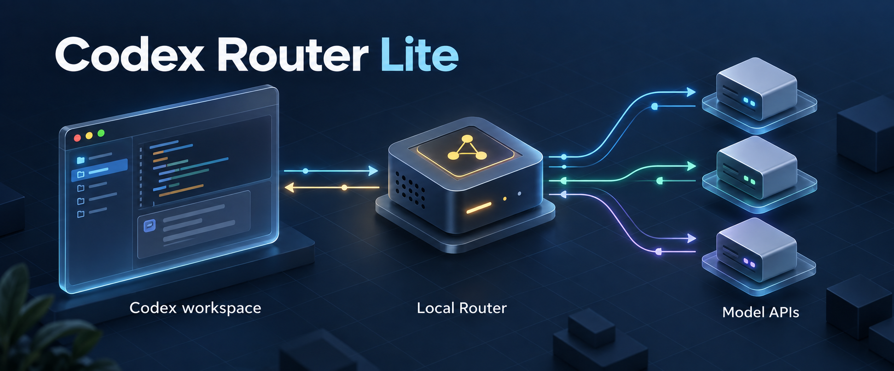

# Codex Router Lite



Codex Router Lite connects supported external model APIs to the Windows Codex
desktop app and command-line client (CLI). It runs as a local service and
translates requests, tool calls, and conversation history between Codex and the
selected provider.
Native GPT models remain available through your Codex login.

This is an unofficial personal project for Windows, currently before version 1.0.

[How it works](#how-it-works) · [Supported models](#supported-models) · [Setup](#setup) · [Add a model](#adding-a-model-or-endpoint) · [Troubleshooting](docs/TROUBLESHOOTING.md)

## What this enables

A supported API model can work in a Codex workspace using the tools available
to that chat. For example, it can:

- Read repository files, edit code, and run commands through Codex's file and terminal tools.
- Write documents and use connected app or MCP tools when those tools are enabled in Codex.
- Follow repository instructions and use skills supplied to the task.
- Continue work after a tool returns its result, with conversation history translated for the provider.
- Handle a delegated part of a task as a Codex subagent, when its model and endpoint are eligible and enabled. See [external subagents](#external-subagents).

You can select an external model for one chat and a native GPT model for another.
Codex still owns tool execution, sandbox permissions, approvals, and connected app
access. The external model receives the tool definitions and returns requests to
use them; Router translates those requests back into the form Codex expects.

## How it works

```text
Codex app or CLI  <-->  Router Lite on your PC  <-->  Selected model API
```

1. You select a configured model in Codex and send a task.
2. Codex sends the conversation and available tool definitions to the local Router.
3. Router prepares the request for the selected provider and sends it to that API.
4. The model returns text or a tool call. Router translates the response for Codex.
5. Codex runs the requested tool under its permissions, then sends the result back so the model can continue.

Each configured model and provider endpoint has its own picker entry. This README
calls that pairing a **route**. The OpenRouter routes below use one fixed endpoint
each, with provider fallback disabled.

Each integration must handle tool calls, streamed responses, and conversation
history in the form Codex expects. Router supports the models listed below;
adding another API model requires compatibility work and testing.

## Supported models

| Model ID | Model and provider | Details |
| --- | --- | --- |
| `openrouter/glm-5.3-flash-streamlake` | GLM-5.3-Flash through OpenRouter / StreamLake FP8 | [Compatibility](docs/agents/openrouter-glm.md) |
| `openrouter/glm-5.3-flash-together` | GLM-5.3-Flash through OpenRouter / Together | [Compatibility](docs/agents/openrouter-glm.md) |
| `openrouter/deepseek-v4.1-flash-together` | DeepSeek V4.1 Flash through OpenRouter / Together | [Compatibility](docs/agents/openrouter-deepseek.md) |
| `openrouter/deepseek-v4.1-flash-deepinfra` | DeepSeek V4.1 Flash through OpenRouter / DeepInfra FP8 | [Compatibility](docs/agents/openrouter-deepseek.md) |
| `openrouter/pareto` | Pareto through OpenRouter / Unbiased | [Compatibility](docs/agents/pareto.md) |
| `switchyard/auto` | Automatically chooses a native GPT model and reasoning effort for the task | [Routing policy](config/switchyard/README.md#routing-policy); separate local build required |

GLM supports web search through its provider and lets you choose a reasoning
effort level. StreamLake supports automatic tool selection; Together also supports
forced tool calls. DeepSeek uses direct Responses with low/high/max reasoning and
function and custom tools; these routes do not provide hosted web search.
Pareto decides when to call available tools; its provider controls
reasoning, and this route has no provider web search. Connected app tools depend
on what Codex makes available to the chat.

Switchyard uses OpenRouter's Jev model to choose a native GPT model for the task.
The selected GPT model produces the answer through your Codex account. Switchyard
requires the separate build described below and an OpenRouter key for its decisions.

Model settings live in [the route configuration](config/openrouter/) and
[Switchyard configuration](config/switchyard/). Subagent test records in
[v2_agent](v2_agent/README.md) apply to the specific versions and endpoints they name.

## Setup

Requirements:

- Windows 10 or 11 and PowerShell 5.1 or newer.
- Git and Node.js 22.19 or newer.
- Python 3.10 or newer, or uv.
- An installed Codex desktop app or native CLI.
- Your own OpenRouter API key for the external models or Switchyard.

### 1. Clone and install

```powershell
git clone https://github.com/stevennitesh/codex-router-lite.git
Set-Location codex-router-lite
.\install.ps1 -Target codex
```

The installer preserves your Codex login and user-owned settings, adds the managed
Codex routing configuration, and installs a local Windows scheduled background task.

### 2. Set your OpenRouter key

```powershell
.\model-router.ps1 codex provider-key openrouter set
```

Enter the key through the protected prompt. Native GPT access uses your existing
Codex login and can run without an OpenRouter key.

### 3. Check the installation

```powershell
.\model-router.ps1 codex doctor
```

### 4. Select a model and use its tools

Fully quit and reopen the desktop app to reload the model picker. Select one of
the configured entries and start a chat in your workspace. In the native CLI,
select the configured model through its model picker.

For an initial check, ask the model to inspect a small file, explain it, and run
an existing check command. Codex should show the tool calls and their results.
The same permissions and approval settings apply as in your other Codex chats.

Switchyard needs a separate [build and deployment](config/switchyard/maintenance.md).
Rust is only needed to build Switchyard. For setup details and recovery, see
[installation](docs/INSTALL.md) and [troubleshooting](docs/TROUBLESHOOTING.md).

### External subagents

By default, Router makes certified external models available as subagents.
Local settings can restrict which of those models Codex may choose. To inspect
eligible models and your local settings:

```powershell
.\model-router.ps1 codex subagents status
```

See the [certification requirements](docs/SUBAGENT-CERTIFICATION.md) for the
checks a new model or endpoint must pass, and the [test records](v2_agent/README.md)
for the versions and endpoints tested.

## Updates

To check for and install a published Router Lite update:

```powershell
.\model-router.ps1 codex update check
.\model-router.ps1 codex update
```

The updater uses `origin/main`, installs published changes, and refuses to merge
diverged local history. See [installation and updates](docs/INSTALL.md#update).

When Codex itself updates, the [compatibility workflow](docs/agents/compatibility-maintenance.md)
checks the installed app and reviews relevant changes in the original Router and
Switchyard projects.

For unexpected responses or tool failures, start with the
[debugging guide](docs/agents/debugging.md). Agents working in this repo can use
[AGENTS.md](AGENTS.md) to load only the guidance their task needs.

## Data sent to providers

Router listens on your PC. For an external model, the conversation, supplied
workspace context, and tool results in the model request go to the selected
provider through OpenRouter. Requests use your protected OpenRouter key; Codex
credentials and account headers are excluded from that external request.

Switchyard sends a limited amount of current task text to OpenRouter/Jev for
model selection, even though a native GPT model answers the task. This can include
the current user message, a recovered assignment to a child agent, or a recognized
task delivery. Ordinary tool results, assistant answers, and reasoning are
excluded from the classifier input. See [security](SECURITY.md) and the
[routing policy](config/switchyard/README.md#routing-policy) for the exact rules.

Enter keys only through the protected prompt. Keep credentials, private prompts,
and unredacted logs out of commits and public issues. Use
[private vulnerability reporting](SECURITY.md) for security problems.

## Adding a model or endpoint

The [model integration guide](docs/agents/model-onboarding.md) covers adding a
model API to the Codex workflow: define the model and endpoint, adapt requests and
tool calls, and test the result through Codex. An OpenAI-compatible API may still
need changes for Codex's tools, history, and streaming responses.

The model registry is [src/routed-models.mjs](src/routed-models.mjs).
[Request preparation](docs/agents/request-preparation.md) describes tool and
history translation. The [system overview](docs/agents/architecture.md) maps the
remaining components and their responsibilities.

## Development and feedback

External pull requests are not accepted. Use the [issue forms](CONTRIBUTING.md)
to report bugs or propose a model, endpoint, or behavior change. You can fork
the repository for your own changes.

Install JavaScript dependencies with `npm ci` for a fresh checkout or a changed
lockfile. For code changes, run the local verification:

```powershell
npm run verify
```

Use the [verification guide](docs/agents/architecture.md#verification) for checks
specific to documentation, catalog, and shared behavior changes. Before release,
run `npm run audit:ci` and audit the hashed Python production lock with the
command in the [GLM dependency guide](docs/agents/openrouter-glm.md#python-dependency-lock).

To install edited source, follow the [deployment guide](docs/INSTALL.md#update).
It explains how to finish or defer active requests, install the changed files,
and restore the previous version if installation fails.

## Attribution

Derived from [duolahypercho/codex-router](https://github.com/duolahypercho/codex-router).
The Lite project maintains the Windows integration and the explicit routes above.
This project is not affiliated with OpenAI or OpenRouter.
[MIT license](LICENSE) · [Attribution](NOTICE.md)
